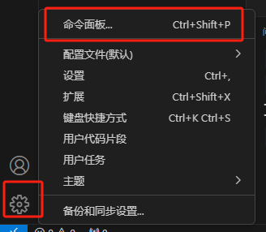
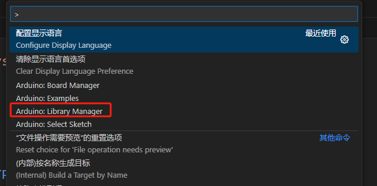
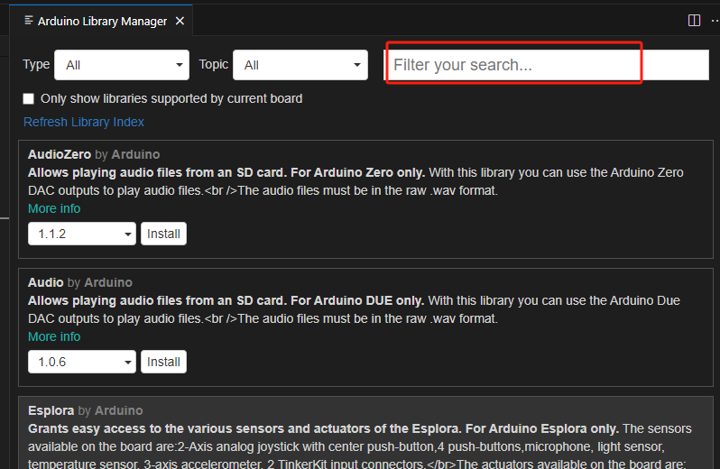

[TOC]


# 结构

## setup：初始化

当Arduino程序开始运行时会调用setup()函数。通常我们setup()函数其中初始化一些变量、引脚状态及一些调用的库等。当Arduino控制器通电或复位后，setup函数会运行一次。

```c++
void setup()
{
    pinMode(13, OUTPUT);
}
```

------

## loop：无限循环

在setup()函数对程序完成了初始化后，loop()函数将会运行。loop函数是一个循环体，在Arduino启动后，loop()函数中的程序将会不断运行。

```C++
void loop()
{
    digitalWrite(13, HIGH);
}
```

------

# I/O  输入输出

## pinMode：引脚模式设定
引脚模式设定，通常在setup函数里，三种引脚模式

> [!IMPORTANT]
>
> OUTPUT：输出模式
>
> INPUT：输入模式
>
> INPUT_PULLUP：输入上拉模式

```c++
void setup()
{
    //第一个参数是引脚号，第二个参数是模式
    pinMode(13, OUTPUT);
}
```
------

## digitalWrite：数字输出
将数字引脚写HIGH（高电平）或LOW（低电平）

### 语法

```
digitalWrite(pin, value)
```

### 参数

`pin`：引脚号码

`value`: [HIGH](http://www.taichi-maker.com/homepage/reference-index/arduino-code-reference/high/) 或 [LOW](http://www.taichi-maker.com/homepage/reference-index/arduino-code-reference/low/)

### 示例

```c++
digitalWrite(13, HIGH);//第一个参数是引脚号，第二个参数是高或低，也可以是1或0
```

------

## digitalRead：数字输入

读取数字引脚的 HIGH(高电平）或 LOW（低电平）。

### 语法

```
digitalRead(pin)
```

### 参数

`pin`：被读取的引脚号码

### 返回

0或1

### 示例

```C++
if(digitalRead(2)==1)
{
    digitalWrite(3,1);
}
```

------

## analogWrite：模拟输出

将一个模拟数值写进Arduino引脚。这个操作可以用来控制**LED的亮度**，或者控制**电机的转速**。

**arduino uno**中，analogWrite()函数支持以下引脚:**<font color='red'>3, 5, 6, 9, 10, 11</font>** 。

在Arduino Mega控制其中,该函数支持引脚 2 – 13 和 44 – 46。

### 语法

```
analogWrite(pin, value)
```

### 参数

`pin`：被读取的模拟引脚号码
`value`：0到255之间

### 示例

```c++
analogWrite(3, 255);
```

------

## analogRead：模拟输入

本指令用于从Arduino的模拟输入引脚(A0-A5)读取数值。主要用于电位器、模拟光强度传感器、模拟声音传感器。数值范围为0-1023.

### 语法

```
analogRead(pin)
```

### 参数

`pin`：被读取的模拟引脚号码

### 返回值

0到1023之间的值

### 示例

```C++
int val = 0;           
 
void setup()
{
    //Arduino串口通讯初始化 
    Serial.begin(9600); 
}
 
void loop()
{
    //读取引脚A0输入信号
    val = analogRead(A0);   

    //将A0输入信号转换为0-1023之间的数值
    //并且通过串口监视器显示 
    Serial.println(val); 
}
```

------

# 控制

## if：条件

通过if指令，用户可以让Arduino判断某一个条件是否达到，并且根据这一判断结果执行相应的程序。


```C++
if( a == 0 ) 
{
	digitalWrite(LEDpin, HIGH);
}
```

在以上示例中，Arduino控制器通过判断变量a是否等于0，从而决定是否执行指令`digitalWrite(LEDpin, HIGH);`
假如变量a确实等于0，则执行这条指令。否则Arduino将不执行这条指令。

**注意：在以上示例的表达式`a == 0`中，`==`是关系运算符号，这条语句的作用是让Arduino判断变量a是否等于零。切记不能使用单一等号`=`。`=`是赋值符号。` a = 0 `的含义是给变量a赋值0。**

------

## if…else：如果...否则


上述结构表示:如果 “表达式1” 的条件得到满足则执行”语句块1″。否则Arduino将执行”语句块2″。

```C++
if( a == 0 ) 
{
    digitalWrite(LEDpin, HIGH);
}
else 
{
    digitalWrite(LEDpin, LOW);
}
```

在以上示例中，Arduino控制器通过判断变量a是否等于0，从而决定是否执行指令（点亮LED）`digitalWrite(LEDpin, HIGH);`
假如变量a确实等于0，则执行这条指令。否则Arduino将不执行指令：(保持LED熄灭）`digitalWrite(LEDpin, LOW);`

------

## for：for循环

for语句用于重复执行一段语句块。通常会使用一个增量计数器递增和终止循环。

```C++
void loop() 
{
   for (int i=0; i <= 255; i++)
   {  //开始运行for循环语句
      analogWrite(9, i);     //对引脚9写入i的数值
      delay(10);                  //延迟10毫秒
   } 
}
```

Arduino运行以上程序后，连接在引脚9上的LED将产生由暗到明的反复变化。

当程序运行到for语句时，首先Arduino将数值0赋值给变量i。接着Arduino将判断i是否满足小于255这一条件。由于此时i = 0，所以 i<=255这一条件为真。于是程序将执行花括号中的程序。

当执行完花括号中的程序后，Arduino将返回到for语句后面括号中的最后一个表达式i++，对i执行加1的操作。执行完这一步后，Arduino再次判断i<=255这一条件是否为真。由于此时i = 1, 即i依然小于255，所以Arduino将再一次执行花括号中的语句块。依此重复循环直到i的数值递增到256时，i不再小于等于255（即 i < = 255这一表达式为假）。这时候Arduino将结束循环执行for语句后面花括号中的程序块。

------

## while：while循环

while循环将会连续地无限地循环，直到圆括号（）中的表达式变为假。被测试的表达式变量必须被改变，否则while循环将永远不会中止。

```C++
void setup() 
{
    // 初始化串口通讯
    Serial.begin(9600);
}
 
void loop() 
{
    int i=1, sum=0;
    while(i<=100)
    {   //判断i是否小于等于零
        sum+=i;  //当i小于等于零时，
        i++;     //执行循环体中的语句。
    }
    Serial.print ("sum = ");  //通过串口监视器输出
    Serial.println (sum);     //while循环结束后的sum值
    
    delay (5000); // 延迟5秒钟    
}
```

1) 程序运行到while语句时，因为 i=1，所以i<=100 为真，于是Arduino将执行循环体（以上示例程序中第22行和第23行语句）；执行结束后 i 的值变为 2，sum 的值变为 1。
2) 接下来Arduino会继续判断 i=100 是否成立，因为此时 i=2，i<=100 成立，所以继续执行循环体；执行结束后 i 的值变为 3，sum 的值变为3。
3) 重复执行步骤 2)。
4) 当循环进行到第100次，i 的值变为 101，sum 的值变为5050；因为此时 i<=100 不再成立，所以Arduino将出循环，不再执行循环体，转而执行while循环后面的代码，延迟五秒钟。

------

## delay()：毫秒延时

delay()函数可用于暂停程序运行。暂停时间可以由delay()函数的参数进行控制，单位是毫秒（1秒钟＝1000毫秒）。

### 示例

```C++
void loop()
{
  digitalWrite(ledPin, HIGH);   // 点亮LED
  delay(1000);                  // 等待一秒钟（1000毫秒）
  digitalWrite(ledPin, LOW);    // 熄灭LED
  delay(1000);                  // 等待一秒钟（1000毫秒）
}
```

------

## delayMicroseconds()：微秒延时

delayMicroseconds()与[delay()](http://www.taichi-maker.com/homepage/reference-index/arduino-code-reference/delay/)函数都可用于暂停程序运行。不同的是，delayMicroseconds()的参数单位是微秒（1毫秒＝1000微秒）。

------

## millis()：获取Arduino开机后运行的时间

millis函数可以用来获取Arduino开机后运行的时间长度，该时间长度单位是毫秒,最长可记录接近50天左右的时间。如果超出记录时间上限，记录将从0重新开始。

### 返回值

Arduino开机后运行的时间长度，此时间数值以毫秒为单位（返回值类型：[无符号长整型](http://www.taichi-maker.com/homepage/reference-index/arduino-code-reference/unsigned-long/)）

### 注意：

millis函数的返回值为[无符号长整型](http://www.taichi-maker.com/homepage/reference-index/arduino-code-reference/unsigned-long/)数据, 如果将该数值与整型数据或其它数据类型进行运算，运行结果将产生错误。

### 示例程序-1

以下实例程序将通过串口监视器输出程序的运行时间

```C++
unsigned long time;
 
void setup(){
  Serial.begin(9600);
}
void loop(){
  Serial.print("Arduino has been running this sketch for ");
  time = millis();
  //输出程序运行时间
  Serial.print(time);
  Serial.println(" milliseconds.");
  delay(1000);
}
```

### 示例程序-2

```C++
/* 
 *  millisBlink
 * 本示例程序使用millis()函数控制Arduino开发板内置LED的点亮和熄灭。
*/
unsigned long previousBlinkTime;
int blinkInterval = 1000; //LED闪烁时间间隔
bool toggle;
 
void setup() {
  pinMode(LED_BUILTIN, OUTPUT); 
  Serial.begin(9600);
}
 
void loop() {  
  unsigned long currentMillis = millis(); // 获取当前时间
  millisBlink(currentMillis);
 
  /* 由于使用millis()函数控制LED闪烁，所以loop函数中没有delay。
   * 于是我们可以在loop函数中流畅的执行其他操作。
  */
 
}
 
void millisBlink(unsigned long currentTime) { 
  //检查是否到达时间间隔
  if (currentTime - previousBlinkTime >= blinkInterval) {    //如果时间间隔达到了
    toggle = (toggle == 1) ? 0 : 1;    
    digitalWrite(LED_BUILTIN, toggle);                       //执行闪烁LED操作
    
    previousBlinkTime = currentTime;  // 将检查时间复位   
    
    Serial.print(F("toggle = "));Serial.println(toggle);          
  }  else if (currentTime - previousBlinkTime <= 0) {   // 如果millis时间溢出
    previousBlinkTime = currentTime;
  }
}
```

------

# 数据类型

## void：无返回值函数

void只用在函数声明中。它表示该函数将不会返回任何数据。

------

## boolean：布尔型

布尔型变量是有两种逻辑状态的变量，它包含两个值:[true](http://www.taichi-maker.com/homepage/reference-index/arduino-code-reference/true-false/)（真）或 [false](http://www.taichi-maker.com/homepage/reference-index/arduino-code-reference/true-false/)（假）。（每个布尔变量占用一个字节的内存。）

如果在表达式中使用了布尔型变量，那么将根据变量值的真假而赋予整型值1或0。要把一个整型变量转换成布尔型变量，如果该变量的整型值为0，则其布尔型值为假；反之如果整型值为非0，则其布尔型值为真。布尔型变量在运行时通常用做标志，比如进行逻辑测试以改变程序流程。

### 示例

```c++
boolean pushButton; // 创建布尔型变量
 
void setup() 
{
    pinMode(2, INPUT_PULLUP); //将引脚2设置为输入上拉模式
    pinMode(13, OUTPUT);      //将引脚13设置为输出模式
}
 
void loop() 
{
    pushButton = digitalRead(2); //读取引脚2电平状态并将其赋值给布尔变量

    if (pushButton)
    {          //根据布尔变量数值点亮或者熄灭LED
    	digitalWrite(13, HIGH); //布尔变量值为真（true）时点亮LED
    }
    else 
    {
    	digitalWrite(13, LOW);  //布尔变量值为假（false）时熄灭LED
    }
}
```

------

## char：字符型

char数据类型使用**1个字节**的内存来存储单个字符值。字符以[ASCII编码](http://www.taichi-maker.com/homepage/reference-index/arduino-code-reference/ascii-code-table/)的形式存储。字符应写在单引号中，如: ‘A’。（char数据类型不能存储字符串。另外在Arduino编程中，由多个字符组成的字符串应使用双引号来表示，如：“ABC”。）

字符的[ASCII](http://www.taichi-maker.com/homepage/reference-index/arduino-code-reference/ascii-code-table/)值可以用来作数学计算。如以下语句：

```C++
char asciiB = 'A'+ 1;
```

以上语句中，因为大写A的[ASCII](http://www.taichi-maker.com/homepage/reference-index/arduino-code-reference/ascii-code-table/)值是65，所以运行结果是66，也就是大写B的[ASCII编码](http://www.taichi-maker.com/homepage/reference-index/arduino-code-reference/ascii-code-table/)。

char数据类型是有符号的类型，这意味着它的编码为-128到127。

### 示例

```C++
char myChar = ‘A’;
char myChar = 65; // 两种声明结果都是相同的
```

## ASCII码

ASCII（American Standard Code for Information Interchange，美国信息互换标准代码，ASCII）是基于拉丁字母的一套电脑编码系统。它主要用于显示现代英语和其他西欧语言。它是现今最通用的单字节编码系统，并等同于国际标准ISO/IEC 646。

ASCII码大致可以分作三部分组成。

### 第1部分：非打印控制字符

ASCII表上的数字0–31分配给了控制字符，用于控制像打印机等一些外围设备。例如，12代表换页/新页功能。此命令指示打印机跳到下一页的开头。当您查看或打印文档时这些字符不会显示出来（详参ASCII码表中0-31）

| 2进制    | 10进制 | 16进制 | 缩写/字符                   | 解释         |
| -------- | ------ | ------ | --------------------------- | ------------ |
| 00000000 | 0      | 00     | NUL(null)                   | 空字符       |
| 00000001 | 1      | 01     | SOH(start of headling)      | 标题开始     |
| 00000010 | 2      | 02     | STX (start of text)         | 正文开始     |
| 00000011 | 3      | 03     | ETX (end of text)           | 正文结束     |
| 00000100 | 4      | 04     | EOT (end of transmission)   | 传输结束     |
| 00000101 | 5      | 05     | ENQ (enquiry)               | 请求         |
| 00000110 | 6      | 06     | ACK (acknowledge)           | 收到通知     |
| 00000111 | 7      | 07     | BEL (bell)                  | 响铃         |
| 00001000 | 8      | 08     | BS (backspace)              | 退格         |
| 00001001 | 9      | 09     | HT (horizontal tab)         | 水平制表符   |
| 00001010 | 10     | 0A     | LF (NL line feed, new line) | 换行符       |
| 00001011 | 11     | 0B     | VT (vertical tab)           | 垂直制表符   |
| 00001100 | 12     | 0C     | FF (NP form feed, new page) | 换页键       |
| 00001101 | 13     | 0D     | CR (carriage return)        | 回车键       |
| 00001110 | 14     | 0E     | SO (shift out)              | 不用切换     |
| 00001111 | 15     | 0F     | SI (shift in)               | 启用切换     |
| 00010000 | 16     | 10     | DLE (data link escape)      | 数据链路转义 |
| 00010001 | 17     | 11     | DC1 (device control 1)      | 设备控制1    |
| 00010010 | 18     | 12     | DC2 (device control 2)      | 设备控制2    |
| 00010011 | 19     | 13     | DC3 (device control 3)      | 设备控制3    |
| 00010100 | 20     | 14     | DC4 (device control 4)      | 设备控制4    |
| 00010101 | 21     | 15     | NAK (negative acknowledge)  | 拒绝接收     |
| 00010110 | 22     | 16     | SYN (synchronous idle)      | 同步空闲     |
| 00010111 | 23     | 17     | ETB (end of trans. block)   | 传输块结束   |
| 00011000 | 24     | 18     | CAN (cancel)                | 取消         |
| 00011001 | 25     | 19     | EM (end of medium)          | 介质中断     |
| 00011010 | 26     | 1A     | SUB (substitute)            | 替补         |
| 00011011 | 27     | 1B     | ESC (escape)                | 溢出         |
| 00011100 | 28     | 1C     | FS (file separator)         | 文件分割符   |
| 00011101 | 29     | 1D     | GS (group separator)        | 分组符       |
| 00011110 | 30     | 1E     | RS (record separator)       | 记录分离符   |
| 00011111 | 31     | 1F     | US (unit separator)         | 单元分隔符   |

### 第2部分：打印字符

数字 32–126 分配给了能在键盘上找到的字符，当您查看或打印文档时这些字符将会显示出来。如数字49代表 字符’1’。（详参ASCII码表中32-127）

| 2进制    | 10进制 | 16进制 | 缩写/字符    | 解释 |
| -------- | ------ | ------ | ------------ | ---- |
| 00100000 | 32     | 20     | (space)      | 空格 |
| 00100001 | 33     | 21     | !            |      |
| 00100010 | 34     | 22     | “            |      |
| 00100011 | 35     | 23     | #            |      |
| 00100100 | 36     | 24     | $            |      |
| 00100101 | 37     | 25     | %            |      |
| 00100110 | 38     | 26     | &            |      |
| 00100111 | 39     | 27     | ‘            |      |
| 00101000 | 40     | 28     | (            |      |
| 00101001 | 41     | 29     | )            |      |
| 00101010 | 42     | 2A     | *            |      |
| 00101011 | 43     | 2B     | +            |      |
| 00101100 | 44     | 2C     | ,            |      |
| 00101101 | 45     | 2D     | –            |      |
| 00101110 | 46     | 2E     | .            |      |
| 00101111 | 47     | 2F     | /            |      |
| 00110000 | 48     | 30     | 0            |      |
| 00110001 | 49     | 31     | 1            |      |
| 00110010 | 50     | 32     | 2            |      |
| 00110011 | 51     | 33     | 3            |      |
| 00110100 | 52     | 34     | 4            |      |
| 00110101 | 53     | 35     | 5            |      |
| 00110110 | 54     | 36     | 6            |      |
| 00110111 | 55     | 37     | 7            |      |
| 00111000 | 56     | 38     | 8            |      |
| 00111001 | 57     | 39     | 9            |      |
| 00111010 | 58     | 3A     | :            |      |
| 00111011 | 59     | 3B     | ;            |      |
| 00111100 | 60     | 3C     | <            |      |
| 00111101 | 61     | 3D     | =            |      |
| 00111110 | 62     | 3E     | >            |      |
| 00111111 | 63     | 3F     | ?            |      |
| 01000000 | 64     | 40     | @            |      |
| 01000001 | 65     | 41     | A            |      |
| 01000010 | 66     | 42     | B            |      |
| 01000011 | 67     | 43     | C            |      |
| 01000100 | 68     | 44     | D            |      |
| 01000101 | 69     | 45     | E            |      |
| 01000110 | 70     | 46     | F            |      |
| 01000111 | 71     | 47     | G            |      |
| 01001000 | 72     | 48     | H            |      |
| 01001001 | 73     | 49     | I            |      |
| 01001010 | 74     | 4A     | J            |      |
| 01001011 | 75     | 4B     | K            |      |
| 01001100 | 76     | 4C     | L            |      |
| 01001101 | 77     | 4D     | M            |      |
| 01001110 | 78     | 4E     | N            |      |
| 01001111 | 79     | 4F     | O            |      |
| 01010000 | 80     | 50     | P            |      |
| 01010001 | 81     | 51     | Q            |      |
| 01010010 | 82     | 52     | R            |      |
| 01010011 | 83     | 53     | S            |      |
| 01010100 | 84     | 54     | T            |      |
| 01010101 | 85     | 55     | U            |      |
| 01010110 | 86     | 56     | V            |      |
| 01010111 | 87     | 57     | W            |      |
| 01011000 | 88     | 58     | X            |      |
| 01011001 | 89     | 59     | Y            |      |
| 01011010 | 90     | 5A     | Z            |      |
| 01011011 | 91     | 5B     | [            |      |
| 01011100 | 92     | 5C     | \            |      |
| 01011101 | 93     | 5D     | ]            |      |
| 01011110 | 94     | 5E     | ^            |      |
| 01011111 | 95     | 5F     | _            |      |
| 01100000 | 96     | 60     | `            |      |
| 01100001 | 97     | 61     | a            |      |
| 01100010 | 98     | 62     | b            |      |
| 01100011 | 99     | 63     | c            |      |
| 01100100 | 100    | 64     | d            |      |
| 01100101 | 101    | 65     | e            |      |
| 01100110 | 102    | 66     | f            |      |
| 01100111 | 103    | 67     | g            |      |
| 01101000 | 104    | 68     | h            |      |
| 01101001 | 105    | 69     | i            |      |
| 01101010 | 106    | 6A     | j            |      |
| 01101011 | 107    | 6B     | k            |      |
| 01101100 | 108    | 6C     | l            |      |
| 01101101 | 109    | 6D     | m            |      |
| 01101110 | 110    | 6E     | n            |      |
| 01101111 | 111    | 6F     | o            |      |
| 01110000 | 112    | 70     | p            |      |
| 01110001 | 113    | 71     | q            |      |
| 01110010 | 114    | 72     | r            |      |
| 01110011 | 115    | 73     | s            |      |
| 01110100 | 116    | 74     | t            |      |
| 01110101 | 117    | 75     | u            |      |
| 01110110 | 118    | 76     | v            |      |
| 01110111 | 119    | 77     | w            |      |
| 01111000 | 120    | 78     | x            |      |
| 01111001 | 121    | 79     | y            |      |
| 01111010 | 122    | 7A     | z            |      |
| 01111011 | 123    | 7B     | {            |      |
| 01111100 | 124    | 7C     | \|           |      |
| 01111101 | 125    | 7D     | }            |      |
| 01111110 | 126    | 7E     | ~            |      |
| 01111111 | 127    | 7F     | DEL (delete) | 删除 |

### 第3部分：扩展打印字符

扩展的ASCII字符满足了对更多字符的需求。扩展的ASCII包含ASCII中已有的128个字符（数字0–32显示在下图中），又增加了128个字符，总共是256个。即使有了这些更多的字符，许多语言还是包含无法压缩到256个字符中的符号。因此，出现了一些ASCII的变体来囊括地区性字符和符号。例如，许多软件程序把ASCII表（又称作ISO8859-1）用于北美、西欧、澳大利亚和非洲的语言。

------

## byte：字节

byte类型变量可存储8位无符号数，其存储数值范围是 0 – 255。

byte类型变量在控制LED时显得格外有用，因为Arduino控制LED亮度或色彩时常常使用的数值是在0-255之间。

### 示例

```C++
byte b ;  // 创建byte类型变量b
 
void setup() {
  Serial.begin(9600); 
}
 
void loop() {
  b++;
  Serial.print("b = ");
  Serial.println(b); 
  /*
   * 将此程序编译并且上传Arduino后，通过串口监视器可以看到
   * 变量b的数值会从0开始逐1递增。在b的数值达到255时，
   * 当变量b再次执行b++操作后，变量b的数值将会复位到0，
   * 然后再次逐1递增。程序将会依次往复循环。
  */
}
```

------

## int：整型

整数是基本数据类型。整数数据类型占用2字节。整数的范围为-32,768到32,767（ -2^15 ~（2^15)-1）。
整数类型使用2的补码方式存储负数。最高位通常为符号位，表示数的正负。其余位被“取反加1”。

### 示例

`int a=10;`

### 提示

```C++
int x;
x = -32,768;
x = x – 1; // x 现在是 32,767。

x = 32,767;
x = x + 1; // x 现在是 -32,768。
```

------

## long：长整型

长整数型变量是扩展的数字存储变量，它可以存储32位（4字节）大小的变量，数值从-2,147,483,648到2,147,483,647。

用法与整型一样。

------

## float：浮点型

float，浮点型数据，就是有小数点的数字。浮点数经常被用来模拟连续值，因为他们比整数具有更大的精确度。浮点数的取值范围在3.4028235 E+38 ~ -3.4028235 E+38。浮点型数据可存储4个字节的数据。

float只有6-7位有效数字。这指的是总位数，而不是小数点右边的数字。在Arduino Uno中，double型与float型的大小相同，这一点是和其它平台不同的。

浮点数字在有些情况下是不准确的，在数据大小比较时，可能会产生奇怪的结果。例如 6.0 / 3.0 可能不等于 2.0。

假如Arduino所运行的程序需要很快速度执行，这时应尽量避免使用浮点型数据运算而采用整数运算。因为浮点运算速度远远慢于整数运算。

进行浮点数值运算时，应在数值末尾加上小数点，否则Arduino将以int类型进行运算处理。

### 示例

```C++
int x;
int y;
float z;
float s = 1.117;

x = 1;
y = x / 2; // 运算结果Y为0
//因为整数不能容纳分数

z = (float)x / 2.0; // 运算结果Z为0.5
// 浮点数运算时必须使用小数点，即使用2.0而不是2。
```

------

## double：双精度浮点型

双精度浮点数。在Arduino Uno中占用4个字节。
目前Arduino Uno上的double数据类型和[float](http://www.taichi-maker.com/homepage/reference-index/arduino-code-reference/float/)数据相同，精度并未提高。

# String：字符串

## 声明

构造 String 类的实例。有多个版本可以从不同的数据类型构造字符串（即将它们格式化为字符序列）

`String thisString = String(13);`返回字符串"13"

`String thisString = String(13, HEX);`返回字符串“d”，是将数字13转换为十六进制后，变成字符串

`String thisString = String(13, BIN);`返回字符串"1101"，转换二进制后变成字符串

### 示例

### 示例代码

以下所有内容都是字符串的有效声明。

```C++
String stringOne = "Hello String";                    // 字符串赋值
String stringOne = String('a');                       // 字符转换字符串后赋值
String stringTwo = String("This is a string");        // 字符串转换字符串对象后赋值
String stringOne = String(stringTwo + " with more");  // 连接字符串后赋值
String stringOne = String(13);                        // 整型转换字符串后赋值
String stringOne = String(analogRead(0), DEC);        // 整型转换十进制后赋值
String stringOne = String(45, HEX);                   // 整型转换十六进制后赋值
String stringOne = String(255, BIN);                  // 整型转换二进制后赋值
String stringOne = String(millis(), DEC);             // 长整型转换十进制后赋值
String stringOne = String(5.698, 3);                  // 小数保留三位小数后赋值
//所有赋值都会转换为字符串对象，方便以后使用字符串相关的处理方法函数
```

------

## charAt()：返回索引位置的字符

`myString.charAt(n)`

返回字符串索引 n 处的字符。

### 示例

```C++
String s="hello";
Serial.println(s.charAt(0));//打印字符h
Serial.println(s.charAt(4));//打印字符o
```

## equals()：比较相等

比较两个字符串是否相等，返回true或false

### 示例

```C++
String s1="hello";
String s2="world"
if(s1.equals(s2))
{
    Serial.println("true");
}
else
{
    Serial.println("false");
}
```

------

## length()：字符串长度

返回字符串长度，也就是字符的个数，包括末尾换行等不可见字符。

### 语法

`myString.length()`

------

## substring()：获得子串


------

## toInt()：转整数

将有效的 String 转换为整数。输入 String 应以整数开头。如果 String 包含非整数，则该函数将停止执行转换。

### 示例

```C++
int a;
String s1="123";
a=s1.toInt();//返回整数123
String s2="123abc";
a=s2.toInt();//返回整数123
String s3="abc123";
a=s3.toInt();//返回整数0
String s4="12a3";
a=s4.toInt();//返回整数12
```

如果由于 String 不以整数开头而无法执行有效转换，则返回零。

------

## toFloat()：转小数

将有效的 String 转换为浮点数。输入字符串应以数字开头。如果字符串包含非数字字符，则该函数将停止执行转换。例如，字符串“123.45”、“123”和“123fish”分别转换为 123.45、123.00 和 123.00。请注意，“123.456”近似为 123.46。另请注意，浮点数只有 6-7 位十进制数字的精度，并且较长的字符串可能会被截断。

`float a=myString.toFloat();`

------

## toLowerCase()：转换为小写字母

该函数就地修改 String，而不是返回新字符串。

`myString.toLowerCase();`

------

## toUpperCase()：转换为大写字母

该函数就地修改 String，而不是返回新字符串。

`myString.toUpperCase();`

------

## trim()：修剪

删除任何前导和尾随空格、换行等不可见字符的字符串。该函数就地修改字符串，而不是返回新字符串。

`myString.trim();`

# 数学

## +-*/：加减乘除

```c++
int c = 9/4;
```

由于c是[整数型变量](http://www.taichi-maker.com/homepage/reference-index/arduino-code-reference/int/)，以上程序运算结果是c = 2。由于[整数型变量](http://www.taichi-maker.com/homepage/reference-index/arduino-code-reference/int/)c不能存储小数，所以运算结果中的小数部分被Arduino忽略了。

```C++
int c = 32767 ＋ 1;
```

由于c是[整数型变量](http://www.taichi-maker.com/homepage/reference-index/arduino-code-reference/int/)，而[整数型变量](http://www.taichi-maker.com/homepage/reference-index/arduino-code-reference/int/)所能存储的最大整数为32767。所以以上程序将会产生溢出效果，这使得运算结果是c ＝ -32768。为了得到正确的运算结果，需要使用适当的变量类型来进行该运算。比如使用[float类型](http://www.taichi-maker.com/homepage/reference-index/arduino-code-reference/float/)或[double类型](http://www.taichi-maker.com/homepage/reference-index/arduino-code-reference/double/)，程序运算结果就是正确的了。

------

## %：取模运算

计算一个数除以另一个数的余数。

```C++
x = 7 % 5; // 运算结果为 2
x = 9 % 5; // 运算结果为 4
x = 5 % 5; // 运算结果为 0
x = 4 % 5; // 运算结果为 4
```

------

## map：等比映射

map()可以用来将某一数值从一个区间等比映射到一个新的区间。

### 语法

`map (x, in_min, in_max, out_min, out_max) `

### 参数

`x`： 要映射的值
`in_min`： 映射前区间最小值
`in_max`： 映射前区间最大值
`out_min`： 映射后区间最小值
`out_max`：映射后区间最大值

### 示例

```C++
void loop()
{
    int val = analogRead(0);
    val = map(val, 0, 1023, 0, 255);  //将变量val数值从 0 － 1023 区间映射到 0 － 255区间
    analogWrite(9, val);
}
```

------

## constrain：范围约束

将一个数值限制到某一区间

`a= constrain(x,a,b);`

### 参数

x: 被限制到某一区间的数值（可以是任何数据类型）

a: 限制区间下限（可以是任何数据类型）

b: 限制区间上限（可以是任何数据类型）

### 返回值

x: 如果x介于a与b之间，则返回x

a: 如果x小于限制区间下限a，则返回a

b: 如果x大于限制区间上限b，则返回b

### 示例

```C++
sensVal = constrain(sensVal, 10, 150);
//将sensVal数值限制在10与150之间
```

------

## pow：指数函数

指数运算。

### 语法

```C++
float pow (float base, float exponent);
```

### 参数

`base`: 底数(float型)

`exponent`:指数 (float型)

### 返回值

指数运算结果。

```C++
a=pow(2,3)//将2的3次方的值赋值给a
```

------

## sqrt：开方函数

开方运算。

### 语法

```C++
double sqrt (double x);
```

### 参数

x: 被开方数

### 返回值

平方根

```C++
a = sqrt(x); // 将x的绝对值数值赋给a
```


## abs：求绝对值

```C++
a = abs(x); // 将x的绝对值数值赋给a
```

## min：最小值

取两者之间最小值。

```C++
sensVal = min(sensVal, 100); // 将 sensVal 或 100 中更小的数值赋给sensVal
// 这么做可以确保sensVal数值永远不超过100
```

## max：最大值

取两者之间最大值。

```C++
sensVal = max(senVal, 20); // 将 sensVal 或 20 中更大的数值赋给sensVal
// 这么做可以确保sensVal数值永远不小于20
```

## 复合运算符

| 自加+ +   | `i++; //相当于 i = i + 1; `   |
| --------- | ----------------------------- |
| 自减--    | `i–-; //相当于 i = i – 1; `   |
| 复合加+=  | ` i+=5; //相当于 i = i + 5; ` |
| 复合减-=  | `i-=5; //相当于 i = i – 5;`   |
| 复合乘*=  | `i*=5; //相当于 i = i * 5;`   |
| 复合除/=  | `i/=5; //相当于 i = i / 5;`   |
| 复合与&=  | `i&=5; //相当于 i = i & 5;`   |
| 复合或\|= | `i|=5; //相当于 i = i | 5;`   |

## random：随机数

random函数可用来产生随机数。

### 语法

```
random(max)
random(min, max)
```

### 参数

`min`: 产生随机数的下限(包含此数值)
`max`: 产生随机数的上限（不包含此数值）

### 返回值

在最小值(min)和最大值减**<font color='red'>max-1</font>**之间的随机数值

------

# 逻辑运算

## && ：与

只有在两个操作数都为真时才返回真。

### 示例

```C++
/*
 * 逻辑与布尔运算
 * 
 * 本示例程序演示逻辑与布尔运算。通过本程序，Arduino将对引脚2和引脚8的电平状态
 * 进行逻辑与布尔运算，并根据运算结果点亮或熄灭引脚13上连接的LED。
 * 
 * 电路：
 * 引脚2连接按键开关1，开关1另一端接地
 * 引脚8连接按键开关2，开关2另一端接地
 * 引脚13上安装有开发板内置LED
*/

boolean pushButton1; // 创建布尔型变量用来存储按键开关1的电平状态
boolean pushButton2; // 创建布尔型变量用来存储按键开关2的电平状态

void setup() {
  pinMode(2, INPUT_PULLUP); //将引脚2设置为输入上拉模式
  pinMode(8, INPUT_PULLUP); //将引脚8设置为输入上拉模式
  pinMode(13, OUTPUT);      //将引脚13设置为输出模式
}

void loop() {
  pushButton1 = digitalRead(2); //读取引脚2电平状态并将其赋值给布尔变量
  pushButton2 = digitalRead(8); //读取引脚8电平状态并将其赋值给布尔变量
  
  if (!pushButton1 && !pushButton2){  //根据逻辑与运算结果点亮或者熄灭LED
    digitalWrite(13, HIGH);           //两个布尔变量数值都为假（false）时点亮LED
  } else {
    digitalWrite(13, LOW);            //否则熄灭LED
  }
}

/*
逻辑与运算说明
!pushButton1 = 1, !pushButton2 = 1 --->  !pushButton1 && !pushButton2 = 1
!pushButton1 = 0, !pushButton2 = 1 --->  !pushButton1 && !pushButton2 = 0
!pushButton1 = 1, !pushButton2 = 0 --->  !pushButton1 && !pushButton2 = 0
!pushButton1 = 0, !pushButton2 = 0 --->  !pushButton1 && !pushButton2 = 0
*/
```

------

## ||：或

任意一个为真时返回真

### 示例

```C++
/*
 * 逻辑或布尔运算
 * 
 * 本示例程序演示逻辑或布尔运算。通过本程序，Arduino将对引脚2和引脚8的电平状态
 * 进行逻辑或布尔运算，并根据运算结果点亮或熄灭引脚13上连接的LED。
 * 
 * 电路：
 * 引脚2连接按键开关1，开关1另一端接地
 * 引脚8连接按键开关2，开关2另一端接地
 * 引脚13上安装有开发板内置LED
*/
boolean pushButton1; // 创建布尔型变量用来存储按键开关1的电平状态
boolean pushButton2; // 创建布尔型变量用来存储按键开关2的电平状态
 
void setup() {
  pinMode(2, INPUT_PULLUP); //将引脚2设置为输入上拉模式
  pinMode(8, INPUT_PULLUP); //将引脚8设置为输入上拉模式
  pinMode(13, OUTPUT);      //将引脚13设置为输出模式
}
 
void loop() {
  pushButton1 = digitalRead(2); //读取引脚2电平状态并将其赋值给布尔变量
  pushButton2 = digitalRead(8); //读取引脚8电平状态并将其赋值给布尔变量
  
  if (!pushButton1 || !pushButton2){    //根据逻辑或运算结果点亮或者熄灭LED
    digitalWrite(13, HIGH);             //两个布尔变量数值任何一个为假（false）时点亮LED
  } else {
    digitalWrite(13, LOW);              //否则熄灭LED
  }
}
 
/*
 * 逻辑或运算说明
!pushButton1 = 1, !pushButton2 = 1 --->  !pushButton1 || !pushButton2 = 1
!pushButton1 = 0, !pushButton2 = 1 --->  !pushButton1 || !pushButton2 = 1
!pushButton1 = 1, !pushButton2 = 0 --->  !pushButton1 || !pushButton2 = 1
!pushButton1 = 0, !pushButton2 = 0 --->  !pushButton1 || !pushButton2 = 0
*/ 
```

------

## !：非

当操作数为假时返回真，为真时返回假

### 示例

```C++
/*
 * 逻辑非布尔运算
 * 
 * 本示例程序演示逻辑非布尔运算。通过本程序，Arduino将对引脚2的电平状态
 * 进行逻辑非布尔运算，并根据运算结果点亮或熄灭引脚13上连接的LED。
 * 
 * 电路：
 * 引脚2连接轻触开关，开关另一端接地
 * 引脚13上安装有开发板内置LED
*/
boolean pushButton; // 创建布尔型变量
 
void setup() {
  pinMode(2, INPUT_PULLUP); //将引脚2设置为输入上拉模式
  pinMode(13, OUTPUT);      //将引脚13设置为输出模式
}
 
void loop() {
  pushButton = digitalRead(2); //读取引脚2电平状态并将其赋值给布尔变量
  
  if (!pushButton){          //对布尔变量进行逻辑非运算，并根据运算结构点亮或者熄灭LED
    digitalWrite(13, HIGH); //布尔变量数值为假（false）时点亮LED
  } else {
    digitalWrite(13, LOW);  //布尔变量数值为真（true）时熄灭LED
  }
}
```

------

# 串口

## Serial.begin()：串口初始化

设置电脑与Arduino进行串口通讯时的数据传输速率，主要使用9600和115200。

```C++
void setup() 
{
	Serial.begin(9600); //打开串口通讯，设置传输速率为9600字节每秒
}
```

------

## Serial.println()：串口换行打印

### 语法

```C++
Serial.println(val)
```

### 参数

`val`: 要发送的数据（任何数据类型）

### 示例

```C++
Serial.println("hello")//字符串需要加双引号
Serial.println(100)
```

------

## Serial.available()：有数据到达

available() 函数可用于检查设备是否接收到数据。

```C++
void loop() 
{
  while (Serial.available())
  {                      // 当串口接收到信息后
    String serialData = Serial.readString();    // 将接收到的信息使用readString()存储于serialData变量
  }
}
```

------

## Serial.readString()：读取字符串

函数从串行缓冲区读取字符到一个字符串中。如果超时，函数将终止。

### 示例

```C++
void setup() { 
    Serial.begin(9600); 
} 

void loop() { 
    Serial.println("Enter data:");
    while (Serial.available() == 0) {} // 等待数据可用
    String teststr = Serial.readString(); // 读取直到超时
    teststr.trim(); // 移除字符串末尾的任何空白字符
    if (teststr == "red") { 
        Serial.println("A primary color"); 
    } else { 
        Serial.println("Something else"); 
    } 
}
```

------

# 扩展库的安装和使用

使用外部传感器和执行器时需要安装扩展库

## 安装

:one:打开命令面板：VSCODE左下角齿轮图标，点击**命令面板**，或者快捷键Ctrl+Shift+P



:two:搜索arduino:library manager



:three:搜索需要安装的库



:four:点击**install**安装

------

## 使用

扩展库安装好之后都有示例程序可以参考，以下是如何打开示例程序。

:one:展开示例文件夹，在VSCODE左下角


:two:展开最后一个文件夹examples from custom libraries，里面的每一个文件夹就是对应扩展库的示例程序文件夹


------

# 传感器

## 温湿度传感器DHT11

安装扩展库**DHT sensor library**

### 对象声明和初始化

```c++
#include "DHT.h"	//头文件
DHT dht(2, DHT11);	//声明DHT类型的对象，类型与头文件名称相同，对象命名为dht，自行起名
void setup() 
{
    //串口打印按需使用
    Serial.begin(9600);
    Serial.println(F("DHT11 test!"));
	//使能传感器
    dht.begin();	
}
```

### 读取数据

```C++
//读取湿度，可以使用浮点型，也可以使用整型
float h = dht.readHumidity();
//读取温度，可以使用浮点型，也可以使用整型
float t = dht.readTemperature();
//注意读取间隔需大于等于2s
```

------

## 超声波传感器

安装扩展库Ultrasonic

### 对象声明

```C++
#include <Ultrasonic.h>   //头文件
/*对象类型为Ultrasonic，与头文件名称相同，对象名称自定义
2个参数，第一个参数为trig连接的引脚号，第二个参数为echo连接的引脚号*/
Ultrasonic ultrasonic(12, 13);  

void setup()
{
    
}
```

### 距离读取

```c++
/*ultrasonic.read()为读取函数，有返回值，需要赋值给变量
distance为前面已经声明过的变量*/
distance = ultrasonic.read();
```

------

# 执行器

------

## 蜂鸣器

发声函数`tone(pin, val)`

pin为引脚号，val为频率值

停止发声函数`noTone(pin)`

pin为引脚号

------

## 舵机

安装扩展库Servo

### 对象声明和初始化

```c++
#include <Servo.h>  //头文件

Servo myservo;  /*对象类型为Servo，与头文件名称相同，对象名称自定义*/

void setup() 
{
  myservo.attach(9);  // attach函数设置舵机连接的引脚号
}
```

### 转到角度

```c++
myservo.write(90);
/*write函数是转到角度功能，参数为绝对度数，非增量度数
可以使用数值，范围0-180，也可以使用int型变量实现动态变化*/
```

------

# 显示器

## 1602

安装扩展库LiquidCrystal_I2C

### 对象声明和初始化

```c++
/*两个头文件是必须的*/
#include <LiquidCrystal_I2C.h>
#include <Wire.h>

/*对象类型LiquidCrystal_I2C，与头文件名称相同
对象名自定义，三个参数：地址，16列，2行*/
LiquidCrystal_I2C lcd(0x27, 16, 2);

void setup()
{
    lcd.init();      // 初始化
    lcd.backlight(); // 打开背光
}
```

### 显示函数

移动光标`lcd.setCursor(列，行)`

显示`lcd.print(val)`   val为要显示的内容，支持字符串和数字类型，字符串要加""

------

# 通信

## 红外遥控

安装扩展库IRremote，版本4.1.2以上

### 初始化

```c++
#include <IRremote.h>//头文件

void setup()
{
  Serial.begin(115200);
  IrReceiver.begin(18);//18为引脚号，按需修改
}
```

### 获取编码和使用编码

```c++
void loop()
{
  if (IrReceiver.decode())//接收到红外遥控信号时，条件为真
  {
  	int a=IrReceiver.decodedIRData.command;//获取编码并赋值给变量a
    Serial.println(a);//打印变量a
    /*对a的值进行判断，执行对应的动作*/
    if (a == 12)
    {
      digitalWrite(5, 1);
    }
    else if (a == 24)
    {
      digitalWrite(5, 0);
    }
  }
  IrReceiver.resume();//等待下一次接收到红外信号
  
}
```

