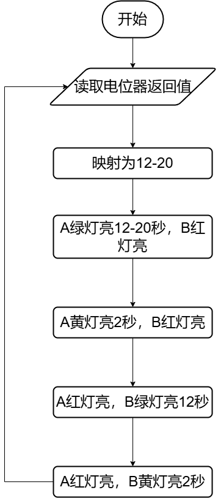

## 2024-06

### 主题：时间可调交通灯（三级）

### 器件

Atmega328P主控板1块，交通灯模块2个（交通灯A和交通灯B），电位器模块1个及相应辅件。以上模块也可使用分立器件结合面包板搭建。

### 任务要求 

交通灯A位于主路，交通灯B位于支路，正常情况下，两个交通灯的黄灯时间为2秒，绿灯时间为12秒。在早晚高峰拥堵时段，主路的绿灯时间根据拥堵情况在12~20秒之间可调，具体说明如下：

(1)装置启动后，交通灯A和交通灯B按照正常的规则，交替工作。交通灯的亮灯顺序为绿灯、黄灯、红灯；

(2)旋转电位器，实现主路交通灯A的绿灯时长在12~20秒之间可调；

(3)根据上述要求，绘制流程图；

(4)未作规定处可自行处理，无明显与事实违背即可。 

### 说明

请考生在考试结束前，按照如下要求提交相关文件。

(1)将程序放在一个文件夹中，压缩为1个“rar或zip”格式文件，并命名为：DJKS3_身份证号，大小5M以下；

(2)将程序文件通过“上传附件”按钮进行上传；

(3)程序编写过程中不得打开其它示例程序，如发现，实操成绩按照0分处理。 

### 评分项

1.器件及器件连接（20分）

2.流程图绘制及功能（20分）

3.功能实现（60分）

(1)实现交通灯A正常工作，即按照绿灯点亮12秒，黄灯点亮2秒，然后红灯点亮；（15分）

(2)实现当交通灯A工作时，交通灯B显示为红灯；（5分）

(3)实现交通灯B正常工作，即按照绿灯点亮12秒，黄灯点亮2秒，然后红灯点亮；（15分）

(4)实现当交通灯B工作时，交通灯A显示为红灯；（5分）

(5)实现通过旋转电位器控制交通灯A的绿灯时长在12~20秒之间可调（测评老师让学生调整到20秒，通过观察判断）。（20分）

### 流程图

