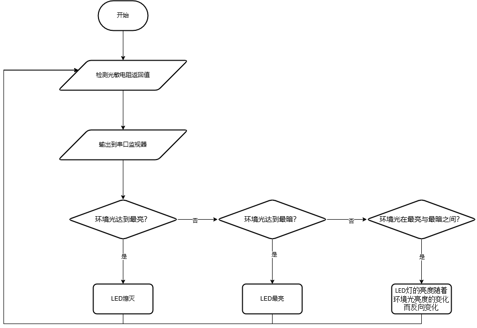

## 2024-09

### 主题：亮度可变灯

### 器件

Atmega328P主控板1块，LED灯模块1个，光敏电阻模块1个及相应辅件。以上模块也可使用分立器件结合面包板搭建。

### 任务要求

通过光敏电阻检测当前环境光的亮度数据，控制LED灯的亮度随着环境光的变化而变化，具体说明如下：

(1) 将当前环境光的亮度数据输出到串口监视器；

(2) 当环境光达到最亮时，LED灯熄灭；

(3) 当环境光最暗时，LED灯达到最亮；

(4) 当环境光在最亮和最暗之间时，LED灯的亮度随着环境光亮度的变化而反向变化；

(5) 根据上述要求，绘制流程图；

(6) 未作规定处可自行处理，无明显与事实违背即可。 

### 说明

请考生在考试结束前，按照如下要求提交相关文件。

(1) 将程序放在一个文件夹中，压缩为1个“rar或zip”格式文件，并命名为：DJKS3_身份证号，大小5M以下；

(2) 将程序文件通过“上传附件”按钮进行上传；

(3) 程序编写过程中不得打开其它示例程序，如发现，实操成绩按照0分处理。 

### 评分项

1.器件及器件连接（20分）

2.流程图绘制及功能（20分）

3.功能实现（60分）

(1) 实现将当前环境光的亮度数据输出到串口监视器；（10分）

(2) 实现当环境光达到最亮时，LED灯熄灭；（15分）

(3) 实现当环境光最暗时，LED灯达到最亮；（15分）

(4) 实现当环境光在最亮和最暗之间时，LED灯的亮度随着环境光亮度的变化而反向变化；（10分）

(5) 第2得分项基本实现，即环境光达到最亮，LED灯熄灭，但由于程序逻辑有漏洞，可能出现LED灯在熄灭时，突然闪烁一下，考生在演示时没有出现上述状况。（10分）

### 流程图

