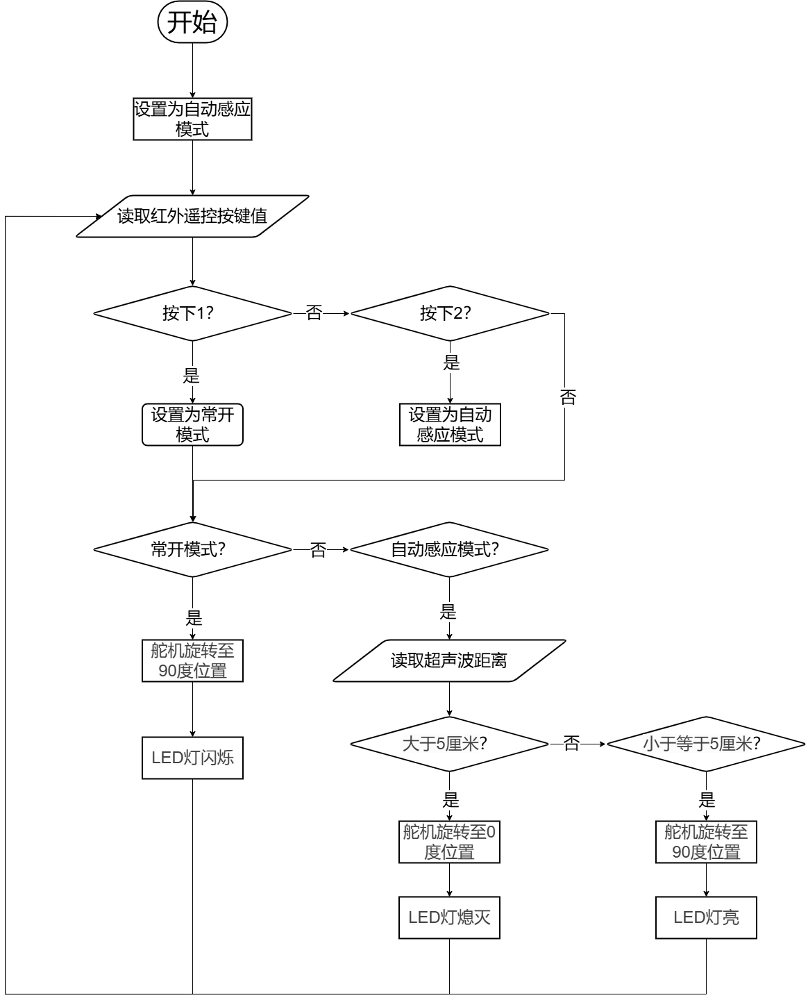

## 2024-12

### 主题：红外遥控门栏

### 器件

Atmega328P主控板1块，LED灯模块1个，红外接收套件1套，舵机1个、超声波传感器1个及相应辅件。以上模块也可使用分立器件结合面包板搭建。

### 任务要求

通过舵机的转动模拟门栏的打开和关闭，门栏有两种功能模式：常开模式和自动感应模式。通过红外遥控控制门栏在两种功能模式之间切换。点击红外遥控器1键，门栏进入常开模式；点击红外遥控器2键，门栏进入自动感应模式。具体说明如下：

(1)当装置通电后，门栏默认处于自动感应模式；

(2)当门栏进入自动感应模式时，通过超声波传感器控制舵机的转动，当超声波传感器检测的距离大于5厘米时，舵机旋转至0度，表示门栏关闭，此时LED灯熄灭。当超声波传感器检测的距离小于等于5厘米时，舵机旋转至90度，表示门栏打开，此时LED灯点亮；

(3)当门栏进入常开模式时，舵机旋转至90度位置，表示门栏打开，此时LED灯闪烁；

(4)根据上述要求，绘制流程图；

(5)未作规定处可自行处理，无明显与事实违背即可。

### 说明

请考生在考试结束前，按照如下要求提交相关文件。

(1) 将程序放在一个文件夹中，压缩为1个“rar或zip”格式文件，并命名为：DJKS3_身份证号，大小5M以下；

(2) 将程序文件通过“上传附件”按钮进行上传；

(3) 程序编写过程中不得打开其它示例程序，如发现，实操成绩按照0分处理。 

### 评分项

1.器件及器件连接（20分）

2.流程图绘制及功能（20分）

3.功能实现（60分）

(1)点击红外遥控器1键，切换到常开模式，实现舵机处于90度位置；（10分）

(2)点击红外遥控器1键，切换到常开模式，实现LED灯闪烁；（10分）

(3)点击红外遥控器2键，切换到自动感应模式，实现当超声波传感器检测的距离大于5厘米时，舵机处于0度位置；（10分）

(4)点击红外遥控器2键，切换到自动感应模式，实现当超声波传感器检测的距离大于5厘米时，LED灯熄灭；（10分）

(5)点击红外遥控器2键，切换到自动感应模式，实现当超声波传感器检测的距离不大于5厘米时，舵机处于90度位置；（10分）

(6)点击红外遥控器2键，切换到自动感应模式，实现当超声波传感器检测的距离不大于5厘米时，LED灯点亮。（10分）

### 流程图

