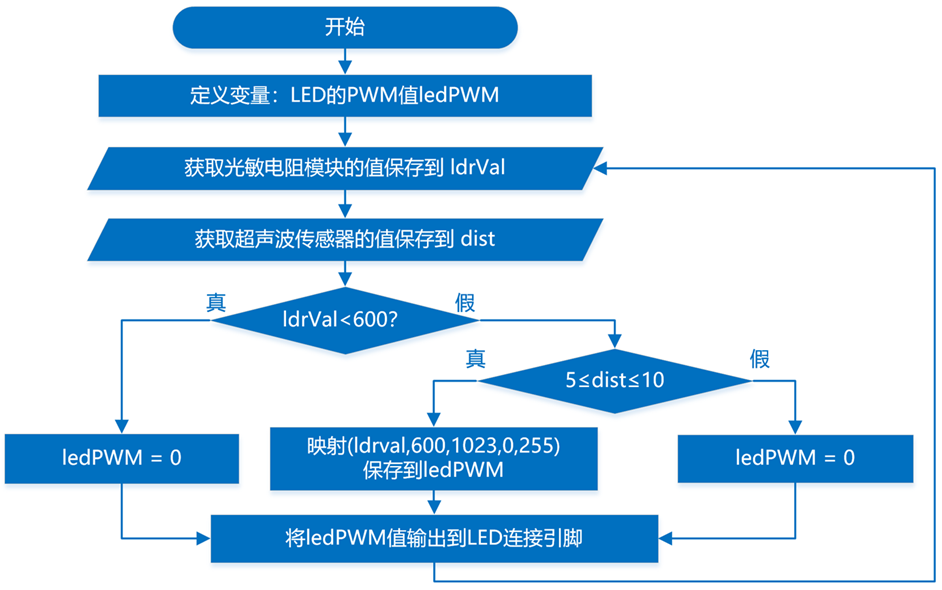

## 2025-06

### 主题：感应节能灯（三级）

### 器件

Atmega328P主控板1块，LED模块1个，光敏电阻模块1个，超声波传感器模块1个。以上模块也可使用分立器件结合面包板搭建。

### 任务要求

任务要求：感应节能灯实现的功能是当光线较暗时，如有行人通过，LED灯点亮。装置通过光敏电阻检测环境光的亮度，使用手不同程度地遮挡光敏电阻来模拟环境光亮度的变化；通过超声波传感器检测是否有行人通过，当超声波检测的距离在5~10厘米范围时，表示有行人通过。具体要求如下：

(1) 当没有行人通过时，LED灯保持熄灭；

(2) 当光敏电阻的返回值小于600（阈值可自行设定）时，表明是白天，此时如有人通过，LED灯保持熄灭；

(3) 当光敏电阻的返回值不小于600时，如有人通过，LED灯点亮，且LED灯的亮度随着环境光的变暗而增加，当环境光达到最暗时，LED灯达到最亮；

(4) 根据上述要求，绘制流程图；

(5) 未作规定处可自行处理，无明显与事实违背即可。

### 说明

(1) 将程序放在一个文件夹中，压缩为1个“rar或zip”格式文件，并命名为：DJKS3_身份证号，大小5M以下；

(2) 将程序文件通过“上传附件”按钮进行上传；

(3) 程序编写过程中不得打开其它示例程序，如发现，实操成绩按照0分处理。

### 评分项

1. 器件及器件连接（20分）
2. 流程图绘制及功能（20分）
3. 功能实现（60分）

(1) 实现当光敏电阻模块没有遮挡时（表明是白天），LED灯保持熄灭状态；（5分）

(2) 实现当光敏电阻模块没有遮挡时（表明是白天），当有行人通过时，LED灯保持熄灭状态；（10分）

(3) 实现当光敏电阻模块有遮挡时（表明天色变暗），没有行人通过时，LED灯保持熄灭状态；（10分）

(4) 实现当光敏电阻模块有遮挡时（表明天色变暗），有行人通过时，LED灯点亮；（15分）

(5) 实现LED灯点亮时，LED灯的亮度随着环境光的变暗而增加亮度；（15分）

(6) 实现当环境光最暗时，LED灯的亮度达到最亮。（5分）

### 流程图

### 参考程序

