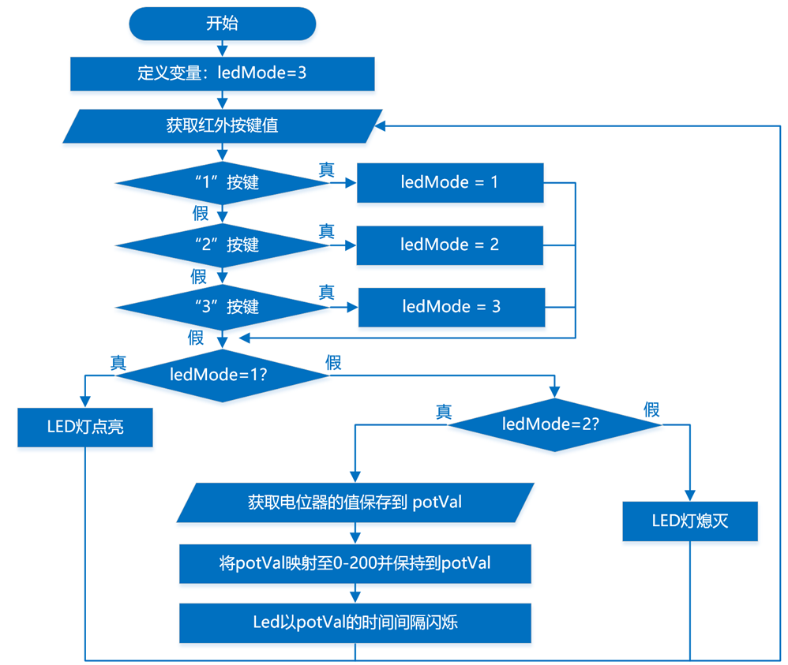
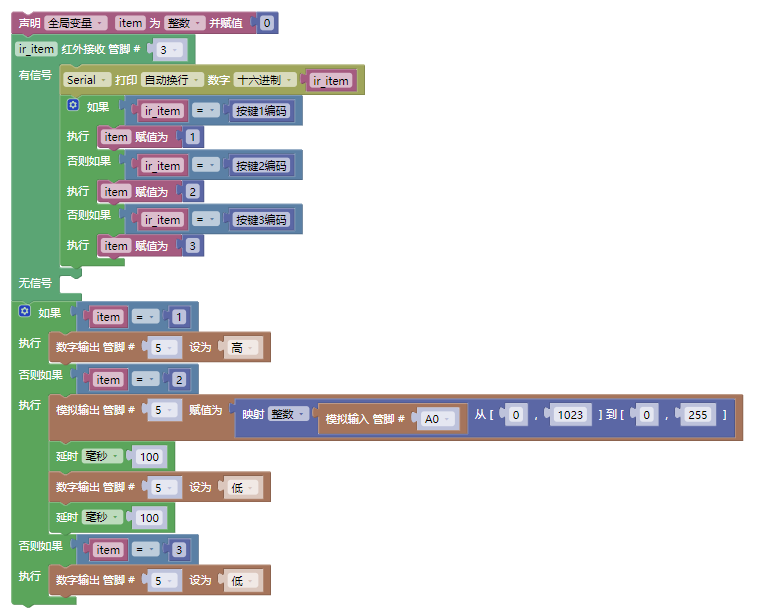

## 2025-09

### 主题：红外遥控灯(三级)

### 器件

Atmega328P主控板1块，红外接收套件1套，LED模块1个，电位器模块1个。以上模块也可使用分立器件结合面包板搭建。

### 任务要求

任务要求：过红外遥控器控制LED灯的不同状态。具体要求如下：

(1) 装置通电后LED灯保持熄灭状态；

(2) 点击红外遥控器的1键，LED灯点亮；

(3) 点击红外遥控器的2键，LED灯闪烁；

(4) 点击红外遥控器的3键，LED灯熄灭；

(5) 当LED灯处于闪烁状态时，旋转电位器，LED灯闪烁的频率发生变化；

(6) 根据上述要求，绘制流程图；

(7) 未作规定处可自行处理，无明显与事实违背即可。

### 说明

(1) 将程序放在一个文件夹中，压缩为1个“rar或zip”格式文件，并命名为：DJKS3_身份证号，大小5M以下；

(2) 将程序文件通过“上传附件”按钮进行上传；

(3) 程序编写过程中不得打开其它示例程序，如发现，实操成绩按照0分处理。

### 评分项

1. 器件及器件连接（20分）
2. 流程图绘制及功能（20分）
3. 功能实现（60分）

(1) 实现装置启动时,LED灯保持熄灭状态；（10分）

(2) 实现点击红外遥控器的1键，LED灯点亮；（10分）

(3) 实现点击红外遥控器的3键，LED灯熄灭；（10分）

(4) 实现点击红外遥控器的2键，LED灯闪烁；（15分）

(5) 实现当LED灯闪烁时，旋转电位器，LED灯闪烁的频率发生变化。（15分）

### 流程图

### 参考程序

