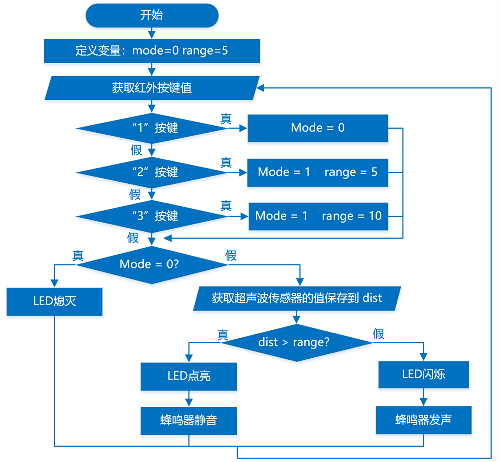

## 2025-12

### 主题：红外遥控障碍检测装置（三级）

### 器件

Atmega328P主控板1块，红外接收套件1套，LED模块1个，超声波传感器1个，蜂鸣器模块1个。以上模块也可使用分立器件结合面包板搭建。

### 任务要求

任务要求：红外遥控障碍检测装置有三种状态，分别为：关闭、近距检测和远距检测。装置处于近距检测状态时，当障碍物距离不大于5cm时，蜂鸣器发出警报声；装置处于远距检测状态，当障碍物距离不大于10cm时，蜂鸣器发出警报声；装置处于关闭状态时，对障碍物靠近不做反应。具体要求如下：

(1) 首次通电后，装置处于关闭状态，此时LED灯熄灭，蜂鸣器静音；

(2) 点击红外遥控器的2键，装置进入近距检测状态，LED灯点亮，当障碍物距离不大于5cm时，蜂鸣器发声，LED灯闪烁；

(3) 点击红外遥控器的3键，装置进入远距检测状态，LED灯点亮，当障碍物距离不大于10cm时，蜂鸣器发声，LED灯闪烁；

(4) 点击红外遥控器的1键，装置进入关闭状态，LED灯熄灭，蜂鸣器静音；

(5) 当装置处于近距检测和远距检测状态时，将超声波传感器的返回值输出到串口监视器；

(6) 根据上述要求，绘制流程图；

(7) 未作规定处可自行处理，无明显与事实违背即可。

### 说明

(1) 将程序放在一个文件夹中，压缩为1个“rar或zip”格式文件，并命名为：DJKS3_身份证号，大小5M以下；

(2) 将程序文件通过“上传附件”按钮进行上传；

(3) 程序编写过程中不得打开其它示例程序，如发现，实操成绩按照0分处理。

### 评分项

1. 器件及器件连接（20分）
2. 流程图绘制及功能（20分）
3. 功能实现（60分）

(1) 实现装置启动时,LED灯保持熄灭状态，蜂鸣器静音；（5分）

(2) 实现点击红外遥控器的2键，装置进入近距检测状态，LED灯处于点亮状态；（5分）

(3) 装置处于近距检测状态时，实现仅当障碍物距离不大于5cm时，蜂鸣器发声，LED灯闪烁；（15分）

(4) 实现点击红外遥控器的3键，装置进入远距检测状态，LED灯处于点亮状态；（5分）

(5) 装置处于远距检测状态时，实现仅当障碍物距离不大于10cm时，蜂鸣器发声，LED灯闪烁；（15分）

(6) 装置处于近距检测和远距检测状态时，将超声波传感器的返回值输出到串口监视器；（10分）

(7) 实现点击红外遥控器的1键，装置进入关闭状态，LED灯熄灭，蜂鸣器静音。（5分）

### 流程图

### 参考程序
