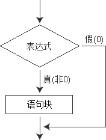

## if：条件

通过if指令，用户可以让Arduino判断某一个条件是否达到，并且根据这一判断结果执行相应的程序。



```C++
if( a == 0 ) 
{
	digitalWrite(LEDpin, HIGH);
}
```

在以上示例中，Arduino控制器通过判断变量a是否等于0，从而决定是否执行指令`digitalWrite(LEDpin, HIGH);`
假如变量a确实等于0，则执行这条指令。否则Arduino将不执行这条指令。

**注意：在以上示例的表达式`a == 0`中，`==`是关系运算符号，这条语句的作用是让Arduino判断变量a是否等于零。切记不能使用单一等号`=`。`=`是赋值符号。` a = 0 `的含义是给变量a赋值0。**

