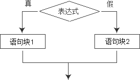

## if…else：如果...否则



上述结构表示:如果 “表达式1” 的条件得到满足则执行”语句块1″。否则Arduino将执行”语句块2″。

```C++
if( a == 0 ) 
{
    digitalWrite(LEDpin, HIGH);
}
else 
{
    digitalWrite(LEDpin, LOW);
}
```

在以上示例中，Arduino控制器通过判断变量a是否等于0，从而决定是否执行指令（点亮LED）`digitalWrite(LEDpin, HIGH);`
假如变量a确实等于0，则执行这条指令。否则Arduino将不执行指令：(保持LED熄灭）`digitalWrite(LEDpin, LOW);`

